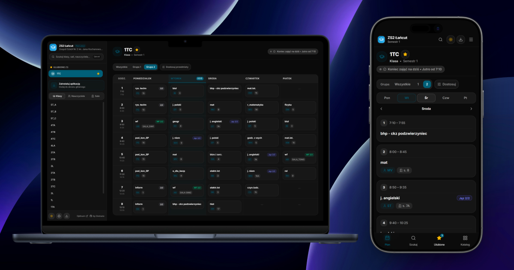

<p align="center">
  
</p>

# 🚀 NeoPlan - Nowoczesny Plan Lekcji

[](https://nextjs.org/)
[](https://react.dev/)
[](https://tailwindcss.com/)
[](https://base-ui.com/)
[](https://developer.mozilla.org/en-US/docs/Web/Progressive_web_apps)

**NeoPlan** to nowoczesna, responsywna i błyskawiczna aplikacja internetowa zastępująca przestarzały, tradycyjny interfejs planów lekcji **VULCAN Optivum**.

Działa z **dowolną szkołą** korzystającą z systemu Optivum - wystarczy podać link do planu w konfiguracji.

---

## ✨ Kluczowe Możliwości

- ⚡ **Niezrównana szybkość (SSG + ISR)**: Wszystkie plany klas, nauczycieli i sal są generowane statycznie w momencie budowania oraz odświeżane w tle (rewalidacja co 1h). Aplikacja ładuje się natychmiast i nie przeciąża szkolnego serwera.
- 📱 **Dwa zoptymalizowane widoki**:
  - **Desktop**: Pełna, czytelna siatka tygodniowa (Poniedziałek - Piątek) z podświetleniem aktywnej godziny i trwającego dnia.
  - **Mobile**: Wygodne karty dni z zakładkami, obsługą gestów swipe (przesuwanie lewo/prawo), wyróżnieniem okienek oraz automatycznym przewijaniem do aktualnej lekcji.
- 👥 **Zaawansowane filtrowanie grup**:
  - Wybór grupy bazowej (np. grupa 1 lub 2).
  - Precyzyjne wyjątki per-przedmiot (np. baza: grupa 1, ale język angielski: grupa 2).
  - Inteligentna obsługa niestandardowych formatów grup VULCAN oraz specyfiki szkół (np. `1/2`, `2/2`, `-I/2`, `-II/`, cyfry rzymskie).
- ⏱️ **Lekcja na żywo w czasie rzeczywistym**: Inteligentny pasek stanu informujący o aktualnie trwającej lekcji lub przerwie wraz z precyzyjnym odliczaniem minut do dzwonka.
- 🔗 **Interaktywne powiązania (cross-referencje)**:
  - Kliknięcie nauczyciela w planie klasy przenosi do rozkładu tego nauczyciela.
  - Kliknięcie sali przenosi bezpośrednio do planu zajęć danej sali.
  - Kliknięcie oddziału w planie nauczyciela/sali przenosi do widoku klasy.
- 🔍 **Błyskawiczna wyszukiwarka (`Ctrl+K` / `Cmd+K`)**: Wyszukiwanie oddziałów, nauczycieli i sal odporne na wielkość liter, polskie znaki diakrytyczne (np. wpisanie `bialy` odnajdzie `T.BIAŁY`) oraz separatory (np. wpisanie `5ta` lub `5t a` bez problemu odnajdzie klasę `5T_A`).
- ⭐ **Ulubione**: Możliwość przypięcia najważniejszych planów (gwiazdka) z natychmiastowym dostępem z paska bocznego i zapamiętywaniem w `localStorage`.
- 📲 **PWA & Tryb Offline**: Dedykowany Service Worker z buforowaniem odwiedzonych planów, automatyczną rejestracją oraz natywnym monitorem instalacji na telefonach (iOS / Android) i komputerach.
- 🌙 **Tryb ciemny (Dark Mode)**: Płynne przełączanie jasny/ciemny.
- 🖨️ **Dedykowany widok wydruku**: Inteligentny arkusz druku.

---

## 🛠️ Wymagania Wstępne

- **Node.js**: w wersji `20.x` lub nowszej (zalecana wersja LTS)
- **Menedżer pakietów**: `npm`, `pnpm` lub `yarn`

---

## 🚀 Uruchomienie Lokalne

### 1. Sklonuj repozytorium

```bash
git clone https://github.com/Domun335/neo-timetable.git
cd neo-timetable
```

### 2. Zainstaluj zależności

```bash
npm install
```

### 3. Skonfiguruj zmienne środowiskowe

Skopiuj plik przykładowy:

```bash
cp .env.example .env
```

Otwórz plik `.env` i ustaw adres URL planu lekcji Twojej szkoły:

```env
TIMETABLE_BASE_URL=https://twoja-szkola.pl/plan/
```

> [!TIP]
> **Inteligentna normalizacja adresu:** Nie musisz martwić się o dokładną strukturę linku. Możesz wkleić dowolny adres z przeglądarki (np. `https://szkola.pl/plan/`, `https://szkola.pl/plan/index.html` czy `https://szkola.pl/plan/plany/o1.html`) — parser automatycznie wyczyści adres i odnajdzie plik `lista.html`.

### 4. Uruchom serwer deweloperski (Opcjonalne)

```bash
npm run dev
```

Aplikacja będzie dostępna pod adresem: [http://localhost:3000](http://localhost:3000).

### 5. Budowanie wersji produkcyjnej

```bash
# Zbudowanie zoptymalizowanego bundle'a SSG
npm run build

# Uruchomienie lokalnego serwera produkcyjnego
npm start
```

---

## ☁️ Wdrożenie na Vercel

Projekt jest w pełni zoptymalizowany pod platformę **Vercel** (App Router, Turbopack, Edge Caching, SSG/ISR).

### Opcja A: Wdrożenie przez Vercel Dashboard (Zalecane)

1. Umieść swój projekt w repozytorium GitHub / GitLab / Bitbucket.
2. Zaloguj się na [vercel.com](https://vercel.com) i kliknij **"Add New..."** -> **"Project"**.
3. Zaimportuj repozytorium z kodem NeoPlan.
4. W sekcji **Environment Variables** dodaj:
   - **Key**: `TIMETABLE_BASE_URL`
   - **Value**: Adres URL do planu lekcji Twojej szkoły (np. `https://twoja-szkola.pl/plan/`)
5. Kliknij **Deploy**.

Vercel automatycznie zbuduje wszystkie strony statyczne i udostępni aplikację pod domeną `*.vercel.app` z globalnym CDN.

---

## ⚙️ Konfiguracja Projektu

Konfiguracja aplikacji podzielona jest na dwa przejrzyste miejsca:

### 1. Zmienne środowiskowe (`.env` / `.env.local`)

| Zmienna                  | Wymagana | Domyślnie | Opis                                                                                                                                   |
| :----------------------- | :------: | :-------: | :------------------------------------------------------------------------------------------------------------------------------------- |
| `TIMETABLE_BASE_URL`     | **TAK**  |     —     | Główny adres do planu lekcji VULCAN Optivum (np. `https://szkola.pl/plan`).                                                            |
| `TIMETABLE_PROXY_URL`    |   NIE    |     —     | URL zewnętrznego serwera proxy (np. `https://cors-anywhere.herokuapp.com/`), przydatne gdy serwer szkoły nakłada ograniczenia IP/CORS. |
| `TIMETABLE_INSECURE_TLS` |   NIE    |  `false`  | Ustawienie na `true` ignoruje błędy nieważnych lub wygasłych certyfikatów SSL serwera szkoły.                                          |

---

### 2. Konfiguracja szkoły (`school.config.js`)

Plik `school.config.js` w głównym katalogu pozwala dostosować dane szkoły, motyw wizualny i metadane SEO:

```javascript
export const schoolConfig = {
  // Pełna nazwa szkoły wyświetlana w stopce i opisach
  name: 'Zespół Szkół Nr 2 im. Jana Kochanowskiego w Łańcucie',

  // Skrócona nazwa wyświetlana w nagłówku i na urządzeniach mobilnych
  shortName: 'ZS2 Łańcut',

  // Źródło URL planu (pobierane ze zmiennej środowiskowej)
  timetableUrl: process.env.TIMETABLE_BASE_URL,

  // Kodowanie znaków serwera:
  // 'auto' (wykrywanie automatyczne), 'utf-8', 'windows-1250', 'iso-8859-2'
  encoding: 'auto',

  // Etykieta semestru / roku szkolnego
  semester: 'Semestr 1',

  // Personalizacja wizualna (Logo jest generowane automatycznie z podanych kolorów)
  branding: {
    primaryColor: '#0284c7', // Główny akcent kolorystyczny (Sky Blue)
    accentColor: '#38bdf8', // Kolor pomocniczy
    // logo: '/custom-logo.png', // Opcjonalnie: własne logo w public/
  },

  // Metadane SEO i udostępniania
  meta: {
    title: 'NeoPlan ZS2 Łańcut',
    description: 'Błyskawiczny plan lekcji dla uczniów i nauczycieli ZS2 Łańcut',
  },
}
```

---

## 📂 Struktura Projektu

```text
neo-timetable/
├── app/                        # Next.js App Router
│   ├── [type]/[id]/            # Dynamiczny widok planu
│   ├── icons/                  # Dynamiczne generowanie ikon PWA (PNG)
│   ├── apple-icon.jsx          # Ikona Apple Web App
│   ├── layout.jsx              # Główny szablon, Sidebar, ThemeProvider
│   ├── manifest.js             # Generator manifestu Web App (PWA)
│   └── page.jsx                # Strona główna z automatycznym przekierowaniem
├── components/                 # Komponenty aplikacji
│   ├── navigation/             # Sidebar, MobileNav, SearchCommand, Ulubione
│   ├── timetable/              # Widok tabeli, widok listy, komórki, filtry grup
│   └── ui/                     # Komponenty Base UI / shadcn (Button, Dialog, Tabs itp.)
├── hooks/                      # Customowe hooki (React 19 / useSyncExternalStore)
│   ├── use-current-lesson.js   # Obliczanie aktualnej lekcji i czasu do dzwonka
│   ├── use-favorites.js        # Zarządzanie listą ulubionych
│   ├── use-group-preferences.js# Filtrowanie i zapamiętywanie grup
│   └── use-pwa-install.js      # Kontrola instalacji aplikacji PWA
├── lib/                        # Moduły pomocnicze i parser
│   ├── search-utils.js         # Normalizacja polskich znaków w wyszukiwaniu
│   └── timetable/              # Pobieranie, mapowanie i kategoryzacja lekcji Optivum
├── public/                     # Pliki statyczne, ikony i Service Worker (sw.js)
├── school.config.js            # Główny plik konfiguracyjny szkoły
└── next.config.mjs             # Konfiguracja Next.js
```

---

## 📜 Skrypty NPM

| Polecenie       | Opis                                                 |
| :-------------- | :--------------------------------------------------- |
| `npm run dev`   | Uruchamia serwer deweloperski Next.js z Turbopack.   |
| `npm run build` | Tworzy zoptymalizowany build produkcyjny.            |
| `npm start`     | Uruchamia lokalny serwer produkcyjny na porcie 3000. |
| `npm run lint`  | Sprawdza poprawność kodu za pomocą ESLint.           |
